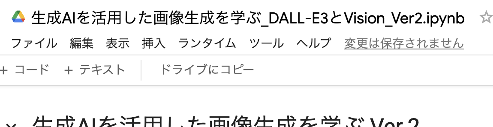

# 生成AIを活用した画像生成を学ぶ

このリポジトリは、生成AIを活用した画像生成について学ぶための資料を提供します。

## 講義スライド

講義で使用したスライドは以下のリンクからアクセスできます。

[生成AIを活用した画像生成を学ぶ - Speaker Deck](https://speakerdeck.com/naoki263/sheng-cheng-aiwohuo-yong-sitahua-xiang-sheng-cheng-woxue-bu)

## ハンズオン用のColabノートブック

ハンズオンで使用するGoogle Colabノートブックは以下のリンクからアクセスできます。

[生成AIを活用した画像生成を学ぶ - Google Colab](https://colab.research.google.com/drive/13ZShxjTamL5fdwrCmQkAGSr1EWfnZdyc?usp=sharing)

注意: Colabノートブックを使用する際は、まず自分のGoogleドライブにコピーしてから実行してください.

## 学習内容

- 生成AIの基礎知識
- 画像生成モデルの仕組み
- 実際の画像生成モデルを使ったハンズオン
- 生成AIを活用した画像生成の応用例

## 前提知識

- Python の基礎知識
- 生成AIの基礎知識
